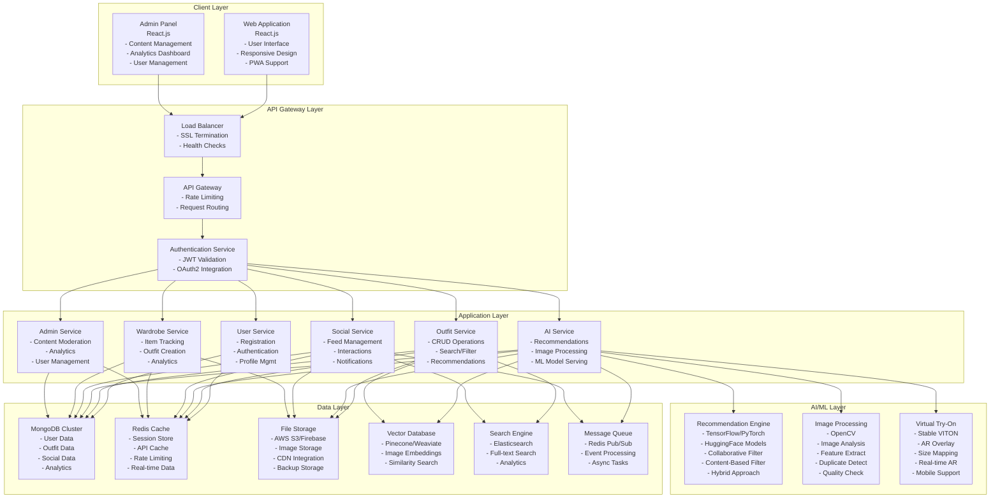
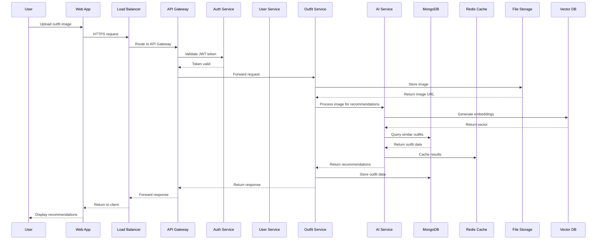
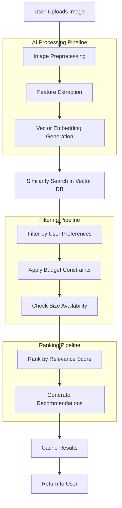
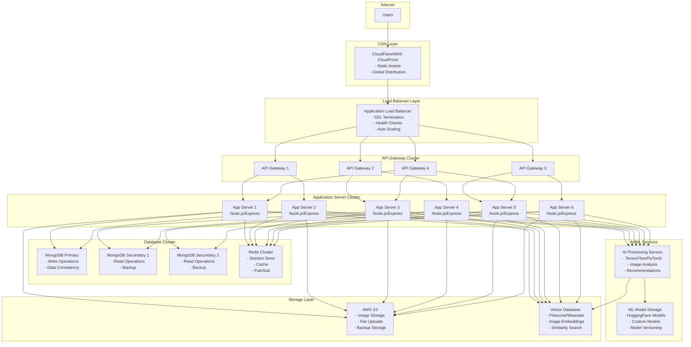
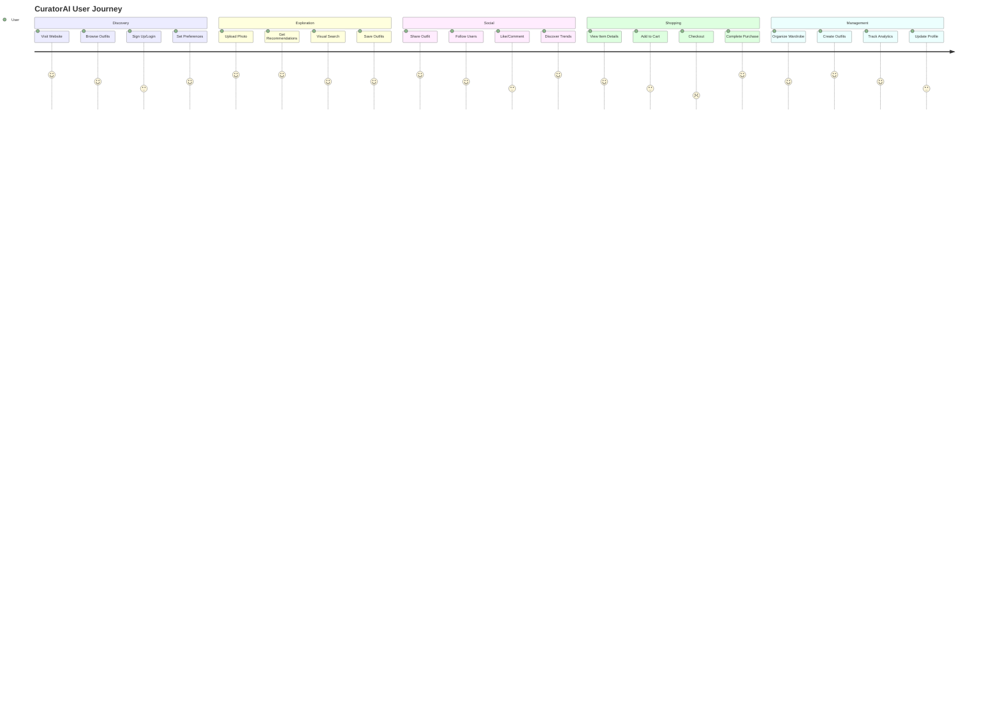
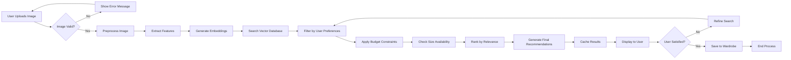

# CuratorAI MVP - System Design Document

**Project:** CuratorAI Fashion Tech Solution  
**Phase:** 1 (MVP)  
**Client:** K&O Curator Technologies Group Ltd.  
**Developer:** Sumic IT Solutions Ltd.  
**Date:** October 1st, 2025  
**Version:** 1.0  

## Table of Contents
1. [Executive Summary](#executive-summary)
2. [System Architecture Overview](#system-architecture-overview)
3. [Technology Stack](#technology-stack)
4. [Core Components](#core-components)
5. [Data Architecture](#data-architecture)
6. [API Design](#api-design)
7. [Security Architecture](#security-architecture)
8. [Deployment Architecture](#deployment-architecture)
9. [Performance Requirements](#performance-requirements)
10. [Scalability Considerations](#scalability-considerations)

## Executive Summary

CuratorAI is an AI-powered fashion tech solution that provides personalized outfit recommendations, virtual try-on capabilities, and social fashion features. The MVP focuses on core functionality including outfit recommendation engine, admin panel, visual outfit search, wardrobe tracking, social feed, and shoppable lookbooks.

### Key Features
- **Outfit Recommendation Engine**: AI-powered suggestions based on user preferences, size, budget, and location
- **Admin Panel**: Content management and analytics dashboard
- **Visual Outfit Search**: Image-based search with 90% duplicate removal
- **Wardrobe Tracking**: Personal clothing inventory management
- **Social Feed**: Community-driven fashion content sharing
- **Shoppable Lookbooks**: Integrated shopping experience

### Acceptance Criteria
- ≥70% of photo uploads return purchasable results
- ≥90% duplicate removal in outfit search
- Recommendations respect size, budget, and location constraints
- All milestones require formal client approval

## System Architecture Overview

### High-Level Architecture



### Detailed Component Architecture

```mermaid
graph TB
    subgraph "Frontend Architecture - React App (Port 3000)"
        subgraph "Components"
            AUTH[Authentication/]
            OR[OutfitRecommendations/]
            VS[VisualSearch/]
            WARD[Wardrobe/]
            SF[SocialFeed/]
            SHOP[Shopping/]
        end
        
        subgraph "Services"
            API[API Service]
            AUTH_SVC[Auth Service]
            IMG[Image Service]
        end
        
        subgraph "State Management"
            REDUX[Redux Store]
            SLICES[Redux Slices]
        end
        
        subgraph "Utils"
            CONST[Constants]
            HELP[Helpers]
            VAL[Validators]
        end
    end
    
    subgraph "Backend Architecture - Express.js API Server (Port 5000)"
        subgraph "Routes"
            R_AUTH[/api/auth]
            R_OUTFITS[/api/outfits]
            R_REC[/api/recommendations]
            R_SEARCH[/api/search]
            R_WARD[/api/wardrobe]
            R_SOCIAL[/api/social]
            R_ADMIN[/api/admin]
        end
        
        subgraph "Middleware"
            MW_AUTH[Authentication]
            MW_AUTHZ[Authorization]
            MW_VAL[Validation]
            MW_RATE[Rate Limiting]
            MW_ERR[Error Handling]
        end
        
        subgraph "Services"
            SVC_USER[UserService]
            SVC_OUTFIT[OutfitService]
            SVC_REC[RecommendationService]
            SVC_SEARCH[SearchService]
            SVC_WARD[WardrobeService]
            SVC_SOCIAL[SocialService]
            SVC_ADMIN[AdminService]
        end
        
        subgraph "Models"
            MODEL_USER[User]
            MODEL_OUTFIT[Outfit]
            MODEL_REC[Recommendation]
            MODEL_POST[SocialPost]
        end
        
        subgraph "Utils"
            UTIL_DB[Database]
            UTIL_CACHE[Cache]
            UTIL_FILE[File Upload]
            UTIL_AI[AI Integration]
        end
    end
    
    AUTH --> API
    OR --> API
    VS --> API
    WARD --> API
    SF --> API
    SHOP --> API
    
    API --> R_AUTH
    API --> R_OUTFITS
    API --> R_REC
    API --> R_SEARCH
    API --> R_WARD
    API --> R_SOCIAL
    API --> R_ADMIN
    
    R_AUTH --> MW_AUTH
    R_OUTFITS --> MW_AUTH
    R_REC --> MW_AUTH
    R_SEARCH --> MW_AUTH
    R_WARD --> MW_AUTH
    R_SOCIAL --> MW_AUTH
    R_ADMIN --> MW_AUTH
    
    MW_AUTH --> SVC_USER
    MW_AUTH --> SVC_OUTFIT
    MW_AUTH --> SVC_REC
    MW_AUTH --> SVC_SEARCH
    MW_AUTH --> SVC_WARD
    MW_AUTH --> SVC_SOCIAL
    MW_AUTH --> SVC_ADMIN
    
    SVC_USER --> MODEL_USER
    SVC_OUTFIT --> MODEL_OUTFIT
    SVC_REC --> MODEL_REC
    SVC_SOCIAL --> MODEL_POST
    
    SVC_USER --> UTIL_DB
    SVC_OUTFIT --> UTIL_DB
    SVC_REC --> UTIL_DB
    SVC_SEARCH --> UTIL_DB
    SVC_WARD --> UTIL_DB
    SVC_SOCIAL --> UTIL_DB
    SVC_ADMIN --> UTIL_DB
```

## Technology Stack

### Frontend
- **Framework**: React.js 18+ with TypeScript
- **State Management**: Redux Toolkit
- **UI Library**: Material-UI (MUI) or Ant Design
- **Styling**: Styled Components or CSS Modules
- **Build Tool**: Vite or Create React App
- **Testing**: Jest + React Testing Library

### Backend
- **Runtime**: Node.js 18+
- **Framework**: Express.js with TypeScript
- **Authentication**: Passport.js with JWT
- **Validation**: Joi or Zod
- **Testing**: Jest + Supertest
- **Documentation**: Swagger/OpenAPI

### Database
- **Primary Database**: MongoDB 6.0+
- **Cache**: Redis 7.0+
- **Vector Database**: Pinecone or Weaviate (for embeddings)
- **File Storage**: AWS S3 or Firebase Storage

### AI/ML Stack
- **Framework**: TensorFlow.js for client-side, Python for server-side
- **Image Processing**: OpenCV 4.10
- **ML Models**: HuggingFace Transformers
- **Vector Search**: FAISS 1.7
- **Virtual Try-On**: Stable VITON or similar

### Infrastructure
- **Cloud Provider**: AWS or Google Cloud
- **Containerization**: Docker + Docker Compose
- **Orchestration**: Kubernetes (for production)
- **CI/CD**: GitHub Actions
- **Monitoring**: Prometheus + Grafana

## Core Components

### 1. User Management Service
**Responsibilities:**
- User registration and authentication
- Profile management
- Preference tracking
- Size and budget management

**Key Features:**
- OAuth2 integration (Google/Facebook)
- Email/password authentication
- User preferences storage
- Size and budget constraints

### 2. Outfit Recommendation Engine
**Responsibilities:**
- AI-powered outfit suggestions
- Style analysis and matching
- Personalization based on user data
- Integration with shopping APIs

**Key Features:**
- Image-based outfit analysis
- Style preference learning
- Budget and size filtering
- Location-based availability

### 3. Visual Search Service
**Responsibilities:**
- Image upload and processing
- Duplicate detection and removal
- Similarity search
- Visual feature extraction

**Key Features:**
- 90% duplicate removal accuracy
- Fast image similarity search
- Visual feature extraction
- Search result ranking

### 4. Wardrobe Management Service
**Responsibilities:**
- Personal wardrobe tracking
- Outfit organization
- Style analytics
- Integration with recommendations

**Key Features:**
- Photo upload and categorization
- Outfit creation and saving
- Style trend analysis
- Recommendation integration

### 5. Social Feed Service
**Responsibilities:**
- Community content sharing
- Social interactions
- Content moderation
- User engagement tracking

**Key Features:**
- Outfit sharing and discovery
- Like, comment, and follow functionality
- Content recommendation
- Moderation tools

### 6. Admin Panel Service
**Responsibilities:**
- Content management
- User analytics
- System monitoring
- Business intelligence

**Key Features:**
- User management dashboard
- Content moderation tools
- Analytics and reporting
- System health monitoring

## Data Architecture

### Database Schema Design

#### Users Collection
```javascript
{
  _id: ObjectId,
  email: String,
  username: String,
  profile: {
    firstName: String,
    lastName: String,
    avatar: String,
    preferences: {
      styles: [String],
      colors: [String],
      brands: [String],
      priceRange: { min: Number, max: Number }
    },
    measurements: {
      size: String,
      height: Number,
      weight: Number,
      bodyType: String
    },
    location: {
      country: String,
      city: String,
      timezone: String
    }
  },
  auth: {
    provider: String, // 'google', 'facebook', 'email'
    providerId: String,
    passwordHash: String
  },
  createdAt: Date,
  updatedAt: Date,
  lastLoginAt: Date
}
```

#### Outfits Collection
```javascript
{
  _id: ObjectId,
  userId: ObjectId,
  title: String,
  description: String,
  images: [{
    url: String,
    thumbnail: String,
    processed: Boolean,
    features: [Number] // AI-extracted features
  }],
  items: [{
    type: String, // 'top', 'bottom', 'shoes', 'accessories'
    brand: String,
    price: Number,
    size: String,
    color: String,
    material: String,
    purchaseUrl: String
  }],
  tags: [String],
  style: String,
  occasion: String,
  season: String,
  isPublic: Boolean,
  likes: Number,
  shares: Number,
  createdAt: Date,
  updatedAt: Date
}
```

#### Recommendations Collection
```javascript
{
  _id: ObjectId,
  userId: ObjectId,
  outfitId: ObjectId,
  score: Number,
  reason: String,
  context: {
    occasion: String,
    weather: String,
    location: String
  },
  createdAt: Date,
  expiresAt: Date
}
```

### Vector Database Schema
```javascript
// For image similarity search
{
  id: String,
  outfitId: String,
  userId: String,
  embedding: [Number], // 512-dimensional vector
  metadata: {
    style: String,
    colors: [String],
    occasion: String,
    season: String
  }
}
```

## Data Flow Architecture

### User Request Flow



### AI Recommendation Flow



## API Design

### RESTful API Endpoints

#### Authentication
```
POST /api/auth/register
POST /api/auth/login
POST /api/auth/logout
POST /api/auth/refresh
GET  /api/auth/profile
PUT  /api/auth/profile
```

#### Outfit Management
```
GET    /api/outfits
POST   /api/outfits
GET    /api/outfits/:id
PUT    /api/outfits/:id
DELETE /api/outfits/:id
POST   /api/outfits/:id/like
POST   /api/outfits/:id/share
```

#### Recommendations
```
GET /api/recommendations
POST /api/recommendations/generate
GET /api/recommendations/:id
PUT /api/recommendations/:id/feedback
```

#### Visual Search
```
POST /api/search/visual
GET  /api/search/similar/:outfitId
POST /api/search/upload
```

#### Wardrobe
```
GET  /api/wardrobe
POST /api/wardrobe/items
PUT  /api/wardrobe/items/:id
DELETE /api/wardrobe/items/:id
```

#### Social Feed
```
GET  /api/feed
POST /api/feed/posts
GET  /api/feed/posts/:id
POST /api/feed/posts/:id/like
POST /api/feed/posts/:id/comment
```

### GraphQL Schema (Alternative)
```graphql
type User {
  id: ID!
  email: String!
  username: String!
  profile: UserProfile!
  outfits: [Outfit!]!
  recommendations: [Recommendation!]!
}

type Outfit {
  id: ID!
  title: String!
  description: String
  images: [Image!]!
  items: [Item!]!
  tags: [String!]!
  style: String!
  isPublic: Boolean!
  likes: Int!
  createdAt: DateTime!
}

type Recommendation {
  id: ID!
  outfit: Outfit!
  score: Float!
  reason: String!
  context: RecommendationContext!
}

type Query {
  me: User
  outfits(first: Int, after: String): OutfitConnection!
  recommendations: [Recommendation!]!
  searchOutfits(query: String!): [Outfit!]!
}

type Mutation {
  createOutfit(input: CreateOutfitInput!): Outfit!
  likeOutfit(outfitId: ID!): Outfit!
  generateRecommendations: [Recommendation!]!
}
```

## Security Architecture

### Authentication & Authorization
- **JWT Tokens**: Short-lived access tokens (15 minutes) + long-lived refresh tokens (7 days)
- **OAuth2**: Google and Facebook integration
- **Role-Based Access Control**: User, Admin, Moderator roles
- **API Rate Limiting**: Per-user and per-endpoint limits

### Data Protection
- **Encryption at Rest**: AES-256 for sensitive data
- **Encryption in Transit**: TLS 1.3 for all communications
- **PII Handling**: GDPR-compliant data processing
- **Image Security**: Secure upload with virus scanning

### Security Headers
```
Content-Security-Policy: default-src 'self'
X-Frame-Options: DENY
X-Content-Type-Options: nosniff
Strict-Transport-Security: max-age=31536000
```

## Deployment Architecture

### Development Environment
```
┌─────────────────┐    ┌─────────────────┐    ┌─────────────────┐
│   React App     │    │   Express API   │    │   MongoDB       │
│   (Port 3000)   │◄──►│   (Port 5000)   │◄──►│   (Port 27017)  │
└─────────────────┘    └─────────────────┘    └─────────────────┘
```

### Production Environment



### Container Configuration
```yaml
# docker-compose.yml
version: '3.8'
services:
  frontend:
    build: ./frontend
    ports:
      - "3000:3000"
    environment:
      - REACT_APP_API_URL=http://localhost:5000
    depends_on:
      - backend

  backend:
    build: ./backend
    ports:
      - "5000:5000"
    environment:
      - MONGODB_URI=mongodb://mongo:27017/curatorai
      - REDIS_URL=redis://redis:6379
    depends_on:
      - mongo
      - redis

  mongo:
    image: mongo:6.0
    ports:
      - "27017:27017"
    volumes:
      - mongo_data:/data/db

  redis:
    image: redis:7.0
    ports:
      - "6379:6379"

volumes:
  mongo_data:
```

## User Journey Flow

### Complete User Experience Flow



### AI Recommendation Process Flow



## Performance Requirements

### Response Time Targets
- **API Response Time**: < 200ms for 95% of requests
- **Image Upload**: < 5 seconds for images up to 10MB
- **Recommendation Generation**: < 3 seconds
- **Visual Search**: < 2 seconds
- **Page Load Time**: < 3 seconds for initial load

### Throughput Requirements
- **Concurrent Users**: 1,000+ simultaneous users
- **API Requests**: 10,000+ requests per minute
- **Image Processing**: 100+ images per minute
- **Database Queries**: 50,000+ queries per minute

### Scalability Metrics
- **Horizontal Scaling**: Auto-scaling based on CPU/memory usage
- **Database Scaling**: Read replicas for query distribution
- **Cache Hit Ratio**: > 90% for frequently accessed data
- **CDN Usage**: Static assets served via CDN

## Scalability Considerations

### Horizontal Scaling Strategy
1. **Stateless Services**: All services designed to be stateless
2. **Load Balancing**: Round-robin distribution across instances
3. **Database Sharding**: User-based sharding for MongoDB
4. **Caching Strategy**: Multi-level caching (Redis + CDN)

### Performance Optimization
1. **Database Indexing**: Optimized indexes for common queries
2. **Query Optimization**: Efficient aggregation pipelines
3. **Image Optimization**: Automatic compression and resizing
4. **CDN Integration**: Global content delivery

### Monitoring and Alerting
1. **Application Metrics**: Response time, error rate, throughput
2. **Infrastructure Metrics**: CPU, memory, disk, network
3. **Business Metrics**: User engagement, conversion rates
4. **Alerting**: Real-time notifications for critical issues

---

**Document Status**: Draft  
**Next Review**: October 8th, 2025  
**Approval Required**: Client formal approval needed before proceeding to Phase 2
